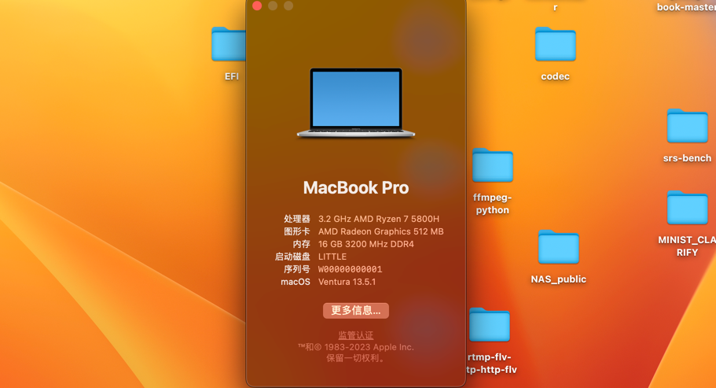

# Hackintosh for xiaoxin pro16 2021 -ACH

This EFI aims to work with `macOS bigsur` now. Stay tuned :)

## Detail

|Properties| Detail                       | Works? |
|---|------------------------------|--|
|CPU| AMD Ryzen 7 5800H            | YES|
|Memory| 16G                          | YES|
|GPU| Vega 8(integrated GPU)       | YES|
|Sound| ALC257 |YES(MIC is investigating)|
|HDMI| Vega 8(integrated GPU)       |YES|
|Network Card| AX200 WiFi6                  |YES|
|iCloud| Sync                         |YES|
|Camera (HID)| FaceTime                     |YES|
|Bluetooth| AX200 WiFi6                  |YES|
|Battery|                              |NO(not showing the percentage, investigating, https://github.com/1Revenger1/ECEnabler/issues/25)|

## Problem
- 浏览器关闭硬件加速，不然卡死
- 看视频用safari 或者 google浏览器，不然容易卡
- qq, vscode等小卡顿, 关闭硬件加速

## Performance

## Credits

- Apple for macOS